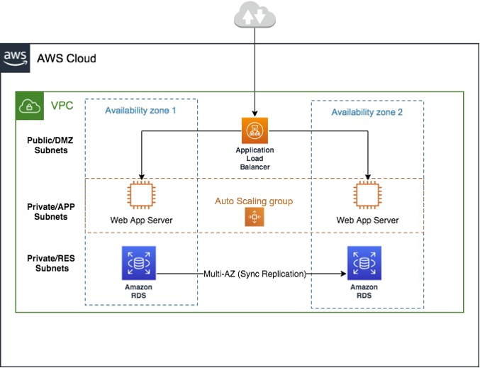

Classic 2-Tier Web Application using Terraform and AWS.

In this lab I created a classic 2-tier Web Application running Apache with a AWS Load Balancer & EC2 instance & RDS Database.

AWS Resources used:
-VPC
-Application Load Balancer
-EC2
-RDS
-IAM

To run this lab you will first need to modify the variables listed in the following files:

Here you can modify your VPC configurations, cd in to:
 - vars\dev\vpc.tfvars

After modification cd into 
 - environments\dev\vpc 
 - use the following command to run script
 - terraform apply -var-file="../../../vars/dev/vpc.tfvars" --auto-approve
 
You will need to grab outputs of VPC module to create Application Load Balancer and Auto Scaling Group

Modify the following variables file to create ALB & ASG
- vars\dev\alb-asg.tfvars
- use VPC Modules output to complete configuration by updating subnets and VPC ID

After modification cd into
- environments\dev\alb-asg
- use the following command to run script
- terraform apply -var-file="../../../vars/dev/alb-asg.tfvars" --auto-approve

Modify the following variables to launch RDS database 
- vars\dev\rds.tfvars
- use VPC modules  & ASG module to complete RDS network configuration

After modification cd into 
- environements\dev\rds
- use the following command to run script
- terraform apply -var-file="../../../vars/dev/backend.tfvars" --auto-approve

The Application Load Balancer is public available by access of port 80. All other resources are in private subnets. The EC2 instances hosting the apache site is in private subnets only available from the Application Load Balancer. The RDS databases are in seperate private subnets only available from access of the private EC2 instances. The site will be accessible from the load balancer DNS name and can be configured in Route53 as a A record to point to specific domain name. 

NAT Gateways are used to allow those instances in the private subnets outbound access to the internet. This way the nodes can be managed and patched routinely to keep up-to-date OS and security features. 
